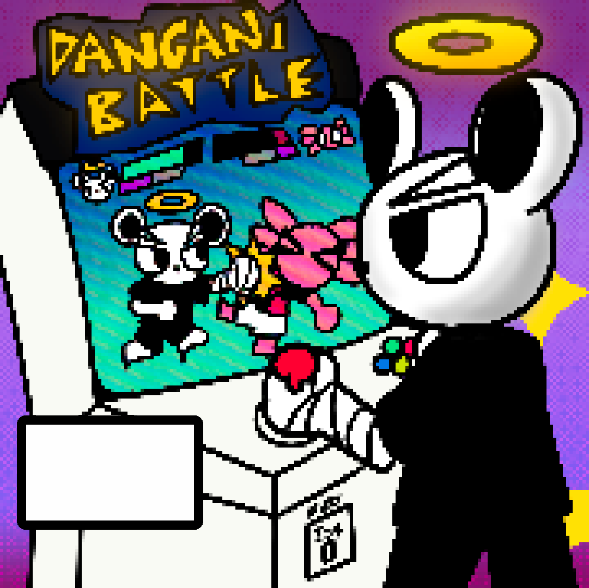

# 🥊 Dangani Battle

A fast-paced, arcade-style HTML beat ‘em up made with nothing but vibes, sweat, and a little AI help.  
Step into the world of **Dangani Studios** and brawl it out with original mascots like Bear Boy, Axolotl, and more!

---

## 🎮 Play It Now

👉 [Click here to play Dangani Battle](https://danganiiiii.github.io/dangani-battle/)  
*(Only can be played with a keyboard on ideally on a desktop or a laptop)*

---

## 🧠 About the Game

- 🔥 Built using just raw HTML (no frameworks, all chaos)
- 💥 Features unique characters and art from [Dangani Studios](https://danganistudios.com)
- 🎵 Custom sound effects and arcade-style action
- 🎨 Inspired by classic Flash games with modern flair

---

## 🕹️ Controls

| Key        | Action         |
|------------|----------------|
| `Arrow Keys` | Move           |
| `Space`          | Punch / Start / Retry |

---

## 📦 Files Included

- `index.html` – Main game file
- `/assets` – Sprites, audio, and images

---

## 💬 Credits

Created by [@danganiiiii](https://github.com/danganiiiii)  
Artwork & characters by **Dangani Studios**

---

## 🚧 Still Cooking...

This is a prototype / early build—expect updates in the future. More levels, characters, and polish coming maybe one day™.
